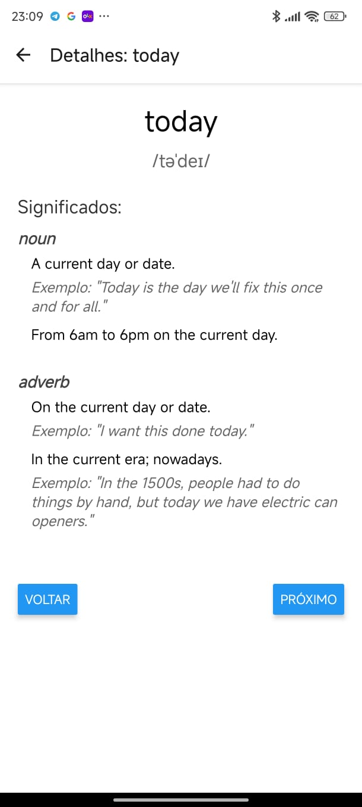

// This is a challenge by Coodesh

# Dictionary API

Uma API que consome dados de um dicionário em inglês para fornecer definições, fonética, exemplos e mais informações sobre palavras.

## Tecnologias Utilizadas

- React Native
- TypeScript
- tsyringe (Injeção de Dependência)
- Axios
- Jest (Testes)

## Instalação e Uso

1. Clone o repositório:
2. Execute o comando `yarn install` ou `npm install`
3. Execute o comando `npx expo start`

## Testes

Para executar os testes, execute o comando `yarn test` ou `npm test`.

## Estrutura do Projeto

- `src/`: Pasta para execução do projeto principal.
- `src/services/`: Serviços para buscar dados da API.
- `src/screens/`: Telas da aplicação.
- `src/components/`: Componentes reutilizáveis.
- `src/di/`: Configuração do container de injeção de dependência.

## Observações

- O projeto foi desenvolvido utilizando o Expo, portanto, para rodar o projeto, é necessário ter o Expo instalado na máquina.
- Para rodar os testes, é necessário ter o Jest instalado na máquina.
- Para rodar o projeto, é necessário ter o Node.js instalado na máquina.

## Explicação do projeto

- Node.js

  - É o ambiente de execução usado em todo o backend do sistema
  - Permite executar JavaScript/TypeScript no servidor

- TSyringe

  - É utilizado para injeção de dependências principalmente nos seguintes locais:
    - src/shared/container/ - Onde os containers de injeção de dependência são configurados
    - src/modules/\*/services/ - Nos serviços onde as dependências são injetadas usando decorators como @injectable() e @inject()

- Jest
  - É o framework de testes utilizado em:
    - src/modules/\*/services/**tests**/ - Testes unitários dos serviços
    - src/shared/infra/http/**tests**/ - Testes de integração das rotas HTTP
    - src/shared/container/**tests**/ - Testes da configuração de injeção de dependência

## Imagens

